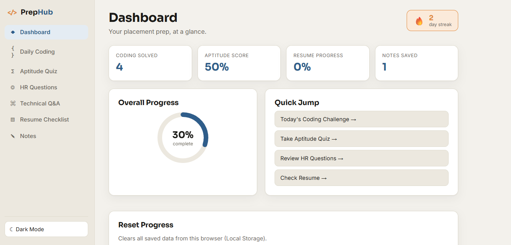

# 🚀 Interview Prep Hub

A modern and responsive Interview Preparation Hub built using **HTML, CSS, and JavaScript** to help students prepare for placements and technical interviews.

## 🌐 Live Demo
https://ashika-prep-hub-interview.netlify.app/

## 📸 Preview



## ✨ Features

- 📊 Dashboard
- 💻 Daily Coding Challenge
- 🧠 Aptitude Quiz
- 👨‍💼 HR Interview Questions
- 👨‍💻 Technical Interview Questions
- 📄 Resume Checklist
- 📈 Progress Tracker (Local Storage)
- 🌙 Dark/Light Mode
- 🔥 Daily Streak Counter
- 📝 Notes Section

## 🛠️ Tech Stack

- HTML5
- CSS3
- JavaScript
- Local Storage

## 📁 Project Structure

```
interview-prep-hub/
├── index.html
├── README.md
├── screenshot.png
├── css/
│   └── style.css
└── js/
    ├── data.js
    └── script.js
```

## 🚀 How to Run

1. Clone the repository:
   ```bash
   git clone https://github.com/ashikapilania/Interview-Prep-Hub.git
   ```

2. Open the project folder.

3. Open `index.html` in your browser.

## 👩‍💻 Author

**Ashika Pilania**

GitHub: https://github.com/ashikapilania
